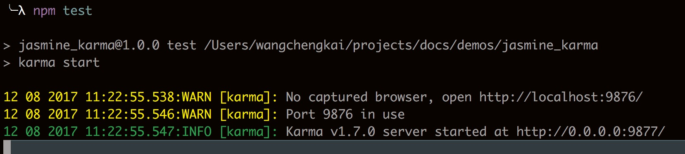
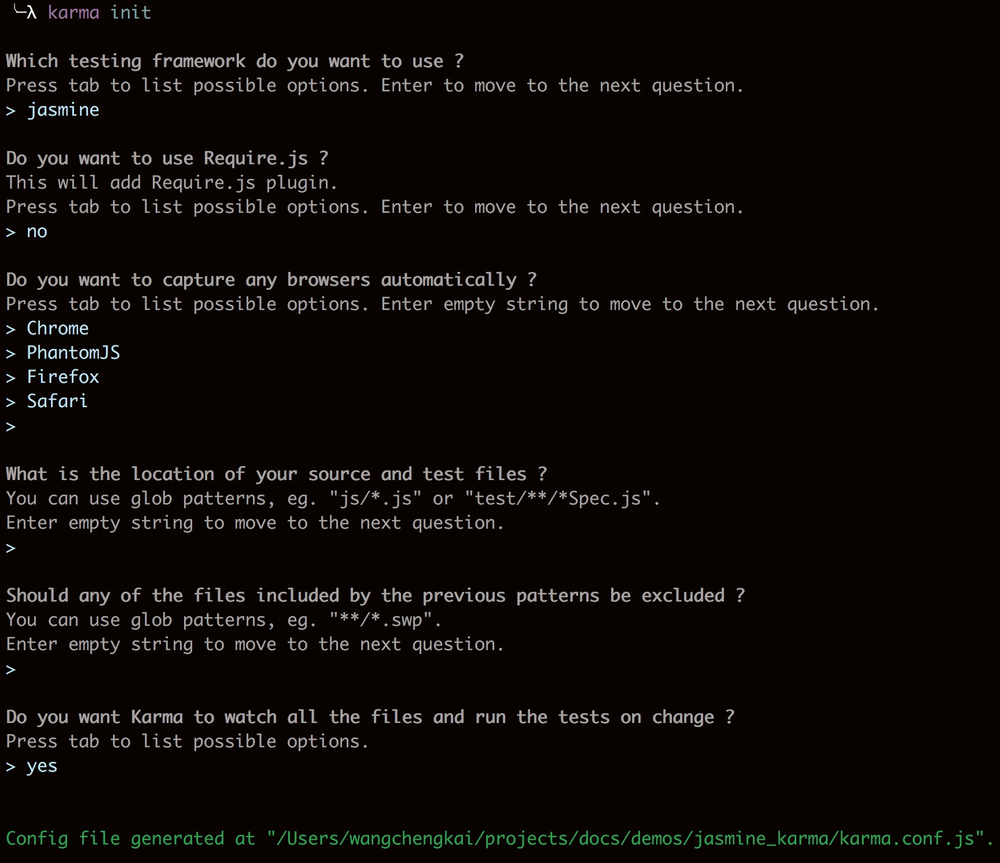
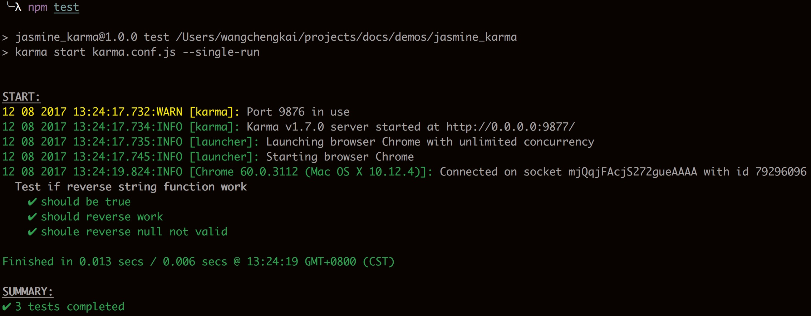
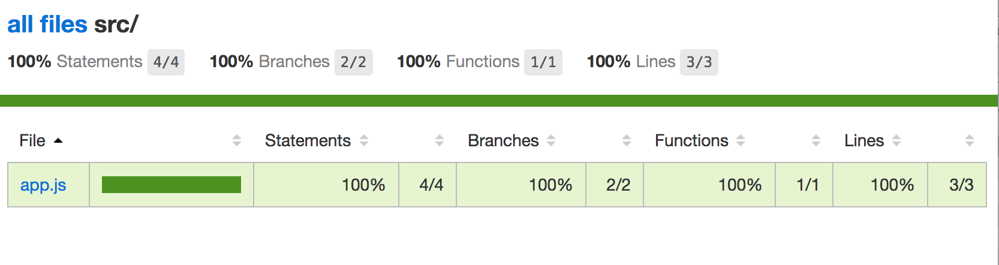
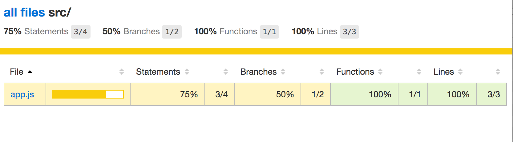
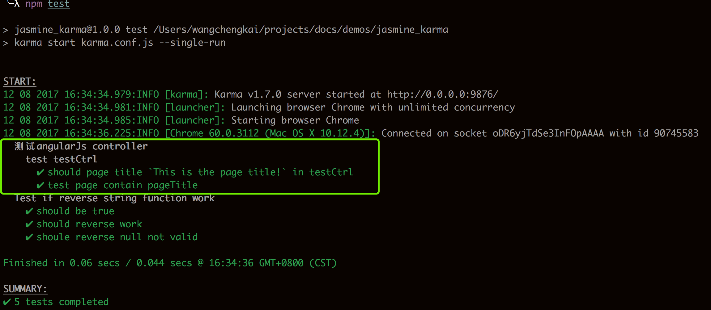
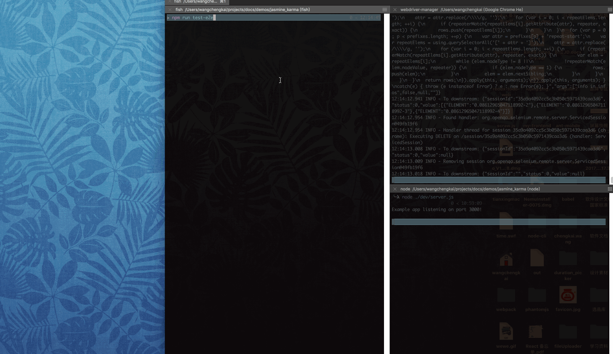

## 测试开发模式
### TDD：测试驱动开发（Test-Driven Development）
> 测试驱动开发是敏捷开发中的一项核心实践和技术，也是一种设计方法论。TDD的原理是在开发功能代码之前，先编写单元测试用例代码，测试代码确定需要编写什么产品代码。TDD的基本思路就是通过测试来推动整个开发的进行，但测试驱动开发并不只是单纯的测试工作，而是把需求分析，设计，质量控制量化的过程。TDD首先考虑使用需求（对象、功能、过程、接口等），主要是编写测试用例框架对功能的过程和接口进行设计，而测试框架可以持续进行验证。
### BDD：行为驱动开发（Behavior Driven Development）
>行为驱动开发是一种敏捷软件开发的技术，它鼓励软件项目中的开发者、QA和非技术人员或商业参与者之间的协作。主要是从用户的需求出发，强调系统行为。BDD最初是由Dan North在2003年命名，它包括验收测试和客户测试驱动等的极限编程的实践，作为对测试驱动开发的回应。

## 测试框架
- [nightwatch](http://nightwatchjs.org/guide/#usage)
- [mocha](http://mochajs.org/)
- [jasmine](https://jasmine.github.io/)
- [protractor](http://www.protractortest.org/)(angularjs)
- [CasperJS](http://casperjs.org/)
- [testcafe](https://devexpress.github.io/testcafe/)
- [codecept](http://codecept.io/)

## 实践一 => 单元测试： jasmine + karma(test runner)

>见 `./demos/jasmine_karma`

### Karma 简单介绍
karma是一个test runner, 即通过nodeJs启动了一个本地服务器，它有启动或捕获运行中浏览器的功能，并让每一个连接到这个服务器的浏览器执行测试代码，每个浏览器对测试代码的执行结果会反馈给这个本地服务器并以命令行log的形式告诉开发者某个浏览器执行某个测试是否成功。
> test runner 捕获浏览器并让其执行测试的两种方法
> 1. 手动打开浏览器输入地址访问，e.g. http://localhost:9876/
> 2. 在配置文件中指定需要启动的浏览器 `browsers: ['Chrome']`, 这里需要注意的是，需要为指定的浏览器安装lanucher插件，例如`npm install karma-chrome-launcher --save-dev`

### 环境配置
- #### 安装依赖
```bash
#初始化项目
npm init -y
# 安装依赖
npm install karma --save-dev
npm install karma-jasmine karma-chrome-launcher jasmine-core --save-dev
```
- ####  npm scripts
```javascript
  "scripts": {
    "test": "karma start"
  },
```
> 安装完成后可在项目路径下执行 npm test 查看是否安装成功
> 

- ### karma 配置
```bash
karma init 
```
> 

> - 现在我们可以改下 `npm scripts` 加上一些命令行参数 (optional)
> ```javascript
>   "scripts": {
>    "test": "karma start karma.conf.js --log-level debug --single-run"
>   },
> ```
>  karma 默认会在项目路径下寻找karma.conf.js 或 karma.conf.coffee作为配置文件
> 使用命令行参数可以覆盖配置项中的配置


## 编写测试

这里是一个最简单的例子

####  依赖

- 需要安装一个reporter, 才能在控制台详尽打印测试报告，这里用karma-mocha-reporter

```bash
npm install karma-mocha-reporter --save-dev
```

- karma.conf.js 设置reporter
```javascript
  reporters: ['mocha'],
```
#### 业务代码

`/src/app.js`

```javascript
function reverseString(str) {
  if (!str) return str;
  return str.split('').reverse().join('');
}
```

#### 编写测试

`/test/specs/reverse.spec.js`

```javascript
describe('Test if reverse string function work', function () {
  it('should be true', function () {
    expect(true).toBe(true);
  });

  it('should reverse work', function () {
    expect(reverseString('hello')).toBe('olleh');
  });

  it('shoule reverse null not valid', function () {
    expect(reverseString(null)).toBeNull;
  });
});
```

> 这里用Jasmine编写测试，具体api可以查看官网 [https://jasmine.github.io](https://jasmine.github.io)

## 运行测试

```bash
npm run test
```

> 


## 测试覆盖率

> 什么是代码覆盖率？简而言之就是测试中运行到的代码占所有代码的比率。其中又可以分为行数覆盖率，分支覆盖率等。具体的含义不再细说，有兴趣的可以自行查阅资料。

- #### 安装karma 覆盖率工具
```bash
npm i --save-dev karma-coverage
```
- #### 修改karma.config.js
```javascript
{
    preprocessors: {
        'src/**/*.js': ['coverage']
    },
    reporters: ['progress', 'coverage'],
}
```
> 再运行`npm test`后，会在目录下生成coverage目录，里面有本次测试的覆盖报告。打开后的结果如下



覆盖率测试概念上面已经简单介绍，下面微调一下测试代码直观感受一下
```javascript
describe('Test if reverse string function work', function () {
  it('should be true', function () {
    expect(true).toBe(true);
  });

  it('should reverse work', function () {
    expect(reverseString('hello')).toBe('olleh');
  });

  //这个测试用例改为xit意为跳过这条测试
  xit('shoule reverse null not valid', function () {
    expect(reverseString(null)).toBeNull;
  });
});
```
再运行测试后, 由于`if (!str)`的情况没有被测试到，所以结果变为：



## AngularJs 项目中的应用

- ### 依赖

`karma.conf.js`

  ```javascript
// 添加angular 和 angularMocks依赖，注意不要重复加载，这里测试用例我用了node_modules中的库，而项目中业务代码引用来自bower管理的代码库, 所以exclude中把bower管理的代码库src/public/**/**.js排除, 防止angular.js重复加载。
files: [
        'node_modules/angular/angular.js',
        'node_modules/angular-mocks/angular-mocks.js',

        'src/**/**.js',
        'test/specs/*.spec.js',
      ],


      // list of files to exclude
  exclude: [
        'src/public/**/**.js'
      ],
  ```

-  ### Controller 测试 demo

#### 业务代码：

```html
<!-- angular-demo/index.html -->
<!DOCTYPE html>
<html lang="en">
<head>
  <meta charset="UTF-8">
  <meta name="viewport" content="width=device-width, initial-scale=1.0">
  <meta http-equiv="X-UA-Compatible" content="ie=edge">
  <title>AngularJs单元测试</title>
</head>
<body ng-controller="testCtrl">
  <h1 ng-bind="pageTitle"></h1>
  <ul>
    <li ng-repeat="info in infos"> {{ info.name }} </li>
  </ul>
  <button ng-click="getInfo()">get infos</button>
  <script src="../public/angular/angular.min.js"></script>
  <script src="./app.js"></script>
</body>
</html>
```

```javascript
//angular-demo/app.js
angular.module('app', [])
  .controller('testCtrl', function ($scope, $http) {
    $scope.pageTitle = 'This is the page title!';
    $scope.infos = [];
    $scope.getInfo = getInfo;

    
    function getInfo() {
      $http.get('./mock.json')
        .then(function (data) {
          $scope.infos = data.data;
        });
    }
  });
  angular.bootstrap(document, ['app']);
```

#### 测试代码：

```javascript
// test/specs/angular.controller.spec.js
'use strict';
describe('测试angularJs controller', function () {
  describe('test testCtrl', function () {
    beforeEach(module('app'));

    var scope, ctrl, $compile;
    //载每个测试用例执行前注入依赖，这里前后的双下划线会被匹配成去掉之后angular中对应的provider
    beforeEach(inject(function ($controller, $rootScope, _$compile_) {
      scope = $rootScope.$new();
      ctrl = $controller('testCtrl', {$scope: scope});
      $compile = _$compile_;
    }));

    it('should page title `This is the page title!` in testCtrl', function () {
      inject(function () {
        expect(scope.pageTitle).toEqual('This is the page title!');
      });
    });

    it('test page contain pageTitle', function () {
      var element = $compile('<div><h1 ng-bind="pageTitle"></h1></div>')(scope);
      scope.$digest();
      expect(element.html()).toContain('This is the page title!');
    });
  });
});
```

执行结果：



## 实践二 =>e2e test:  protractor + karma 

> 端对端测试(end to end test)或UI测试 ，是一种黑盒测试，不考虑程序内部逻辑和实现，只考虑目标行为是否符合预期，例如点击某个按钮等交互后是否能从页面上获得期望的执行结果。

### 依赖

```bash
# protractor也可以全局安装,这里选择安装在项目路径中
npm install  protractor karma --save-dev 
#更新webdriver需要的jar包
./node_modules/.bin/webdriver-manager update 
#测试安装结果
./node_modules/.bin/webdriver-manager start
```

### 准备可访问的被测试页面

```javascript
# /dev/servers.js
const express = require('express')
const app = express()

app.get('/', function (req, res) {
  res.send('Hello World!')
});
app.use(express.static('./src'));
app.listen(3000, function () {
  console.log('Example app listening on port 3000!')
});
```

> node /dev/server.js 启动本地开发服务器，即可以通过localhost:3000/angular-demo访问到angular demo 的静态资源页面

### protractor 配置

```javascript
// e2e.config.js u can customize this name
exports.config = {
  seleniumAddress: 'http://localhost:4444/wd/hub',
  //把要测试的测试用例包含在下面的数组中
  specs: ['test/e2e/test-spec.js'],
  // capabilities: {
  //   'browserName': 'phantomjs',
  //   'phantomjs.binary.path': require('phantomjs').path
  // }
  // 更多配置请阅读官网api
};
```


### 编写测试脚本

```javascript
// test/e2e/test-spec.js
describe('angularjs homepage add info', function() {
  it('should add 3 infos', function() {
    browser.get('http://localhost:3000/angular-demo');

    var infos = element.all(by.repeater('info in infos'));
    expect(infos.count()).toEqual(0);

    element(by.css('get-info-btn')).click();
    var infos = element.all(by.repeater('info in infos'));
    expect(infos.count()).toEqual(3);
  });
});
```

>  具体测试用例的编写可以参考jasmine和protractor的api

### 运行测试

运行测试前请先确保被测试网站可访问，并且webdriver服务启动

```bash
node dev/server.js
./node_modules/.bin/webdriver-manager start
```

执行以下命令开启测试

```bash
protractor ./e2e.config.js
```

如果没有全局安装protractor（本例中就没有），可以集成到npm scripts中

```javascript
  "scripts": {
    "test-e2e": "protractor ./e2e.config.js"
  }
```

运行后即可看到执行结果，执行过程中浏览器窗口会一闪而过，迅速打开完成测试操作



