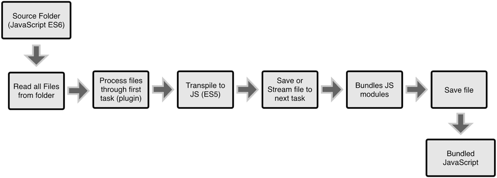

## Webpack checksheet

[TOC]

### 入门

> #### 什么是Webpack
>
> *webpack* 是一个现代 JavaScript 应用程序的*模块打包器(module bundler)*。当 webpack 处理应用程序时，它会递归地构建一个*依赖关系图(dependency graph)*，其中包含应用程序需要的每个模块，然后将所有这些模块打包成少量的 *bundle* - 通常只有一个，由浏览器加载。
>
> #### WebPack和Grunt以及Gulp相比有什么特性
> 其实Webpack和另外两个并没有太多的可比性，Gulp/Grunt是一种能够优化前端的开发流程的工具，而WebPack是一种模块化的解决方案，不过Webpack的优点使得Webpack在很多场景下可以替代Gulp/Grunt类的工具。webpack 把[每个文件(.css, .html, .scss, .jpg, etc.) 都作为模块](https://doc.webpack-china.org/concepts/modules)处理。然而 webpack 自身**只理解 JavaScript**。

> #### 四个核心概念
> `入口(entry)`、`输出(output)`、`loader`、`插件(plugins)`。

> gulp/grunt 工作方式：
> 
> webpack 工作方式：
> 

### 定义入口文件

- 单入口(简写)

```javascript
const config = {
  entry: './path/to/my/entry/file.js'
};

module.exports = config;


//是以下写法的简写形式
const config = {
  entry: {
    main: './path/to/my/entry/file.js'
  }
};
```

- 对象写法

```javascript
//对象写法，此方法扩展性比较好
const config = {
  entry: {
    app: './src/app.js',
    vendors: './src/vendors.js'
  }
};
```

#### entry用法的一些常用实例

- 分离app和第三方库

```javascript
const config = {
  entry: {
    app: './src/app.js',
    vendors: './src/vendors.js'
  }
};
```

> **这是什么？**从表面上看，这告诉我们 webpack 从 `app.js` 和 `vendors.js` 开始创建依赖图(dependency graph)。这些依赖图是彼此完全分离、互相独立的（每个 bundle 中都有一个 webpack 引导(bootstrap)）。这种方式比较常见于，只有一个入口起点（不包括 vendor）的单页应用程序(single page application)中。
>
> **为什么？**此设置允许你使用 `CommonsChunkPlugin` 从「应用程序 bundle」中提取 vendor 引用(vendor reference) 到 vendor bundle，并把引用 vendor 的部分替换为 `__webpack_require__()` 调用。如果应用程序 bundle 中没有 vendor 代码，那么你可以在 webpack 中实现被称为[长效缓存](https://doc.webpack-china.org/guides/caching)的通用模式。

- 多页面应用程序

```javascript
const config = {
  entry: {
    pageOne: './src/pageOne/index.js',
    pageTwo: './src/pageTwo/index.js',
    pageThree: './src/pageThree/index.js'
  }
};
```

> **这是什么？**我们告诉 webpack 需要 3 个独立分离的依赖图（如上面的示例）。
>
> **为什么？**在多页应用中，（译注：每当页面跳转时）服务器将为你获取一个新的 HTML 文档。页面重新加载新文档，并且资源被重新下载。然而，这给了我们特殊的机会去做很多事：
>
> - 使用 `CommonsChunkPlugin` 为每个页面间的应用程序共享代码创建 bundle。由于入口起点增多，多页应用能够复用入口起点之间的大量代码/模块，从而可以极大地从这些技术中受益。
>
> > 根据经验：每个 HTML 文档只使用一个入口起点。

### 输出文件定义

> 配置 output 选项可以控制 webpack 如何向硬盘写入编译文件。注意，即使可以存在多个入口起点，但只指定一个输出配置。在 webpack 中配置 `output` 属性的最低要求是，将它的值设置为一个对象，包括以下两点：
>
> - `filename` 用于输出文件的文件名。
> - 目标输出目录 `path` 的绝对路径。

```javascript
const config = {
  output: {
    filename: 'bundle.js',
    path: '/home/proj/public/assets'
  }
};

module.exports = config;
```

如果配置创建了多个单独的 "chunk"（例如，使用多个入口起点或使用像 CommonsChunkPlugin 这样的插件），则应该使用[占位符(substitutions)](https://doc.webpack-china.org/configuration/output#output-filename)来确保每个文件具有唯一的名称。

```javascript
{
  entry: {
    app: './src/app.js',
    search: './src/search.js'
  },
  output: {
    filename: '[name].js',
    path: __dirname + '/dist'
  }
}

// 写入到硬盘：./dist/app.js, ./dist/search.js
```

- 以下是使用 CDN 和资源 hash 的复杂示例：

```javascript
output: {
  path: "/home/proj/cdn/assets/[hash]",
  publicPath: "http://cdn.example.com/assets/[hash]/"
}
```


###sourceMap配置

配置devtool选项：

| value                        | Description                              |
| :--------------------------- | ---------------------------------------- |
| source-map                   | 在一个单独的文件中产生一个完整且功能完全的文件。这个文件具有最好的source map，但是它会减慢打包速度 |
| cheap-module-source-map      | 在一个单独的文件中生成一个不带列映射的map，不带列映射提高了打包速度，但是也使得浏览器开发者工具只能对应到具体的行，不能对应到具体的列（符号），会对调试造成不便； |
| eval-source-map              | 使用eval打包源文件模块，在同一个文件中生成干净的完整的source map。这个选项可以在不影响构建速度的前提下生成完整的sourcemap，但是对打包后输出的JS文件的执行具有性能和安全的隐患。在开发阶段这是一个非常好的选项，在生产阶段则一定不要启用这个选项； |
| cheap-module-eval-source-map | 这是在打包文件时最快的生成source map的方法，生成的Source Map 会和打包后的JavaScript文件同行显示，没有列映射，和eval-source-map选项具有相似的缺点； |

> 常用： eval-source-map

2. #### dev-server 本地开发服务器配置

   ```javascript
   devServer: {
     contentBase: path.join(__dirname, "dist"), //支持数组，多路径
     compress: true, //Enable gzip compression for everything served:
     port: 9000, //content is served from dist
     clientLogLevel: "warning", //日志级别 [none|error|warning|info(default)],
     color: true, //Enables/Disables colors on the console.

     lazy: true,
     filename: 'bundle.js', //需要和lazy配合使用，懒编译模式，只在bundle.js被请求时编译它

     headers: {
       //给所有请求增加额外的请求头
       "x-custom-token": "xxxx"
     },
     historyApiFallback: true, //SPA中常用，把所有页面请求指向但一页面，如index.html
     // 更多配置的用法，支持rewrite
     historyApiFallback: {
       rewrites: [
         { from: /^\/$/, to: '/views/landing.html' },
         { from: /^\/subpage/, to: '/views/subpage.html' },
         { from: /./, to: '/views/404.html' }
       ]
     },
    
     host: '127.0.0.2', //指定host地址，默认localhost
     hot: true, //Enable webpack's Hot Module Replacement feature
     https: true,
     inline: true, //默认true, 打包后的js文件中会植入一段脚本来控制热重载，编译信息会显示在console中。false则通过iframe方式来显示
     open: true, //是否打开浏览器 webpack-dev-server --open
     openPage: '/different/page',//指定打开浏览器后跳转的页面
     overlay: {
       //Shows a full-screen overlay in the browser when there are compiler errors or warnings. Disabled by default. If you want to show only compiler errors:
       warnings: true,
       errors: true
     },
    
     //usage1
     proxy: {
         "/api": {
             target: "http:localhost:3000",
             pathRewrite: { "^/api": "" }
         },
         "/backend": {
             target: "https: abc.com",
             secure: false //https 需要此选项
         }
     },
     //usage2
     proxy: [
       {
   	  context: ["/auth", "/api"],
         target: "localhost:3000"
       }
     ]
    
     // 获取Express中的app具柄，可以用来自定义中间件
     setup(app) {
         app.get('/some/path', function (req, res) {
            res.send({custom: "response"});
         })
     },
     watchContentBase: true, //Tell the server to watch the files served by the devServer.contentBase option. File changes will trigger a full page reload.
   }
   ```


> 使用NodeJs API 方式时此配置将被忽略，NodeJs API 方式使用devServer的例子：
>
> [https://webpack.js.org/configuration/dev-server/#devserver](https://webpack.js.org/configuration/dev-server/#devserver)
>
> [https://github.com/webpack/webpack-dev-server/blob/master/examples/node-api-simple/server.js](https://github.com/webpack/webpack-dev-server/blob/master/examples/node-api-simple/server.js)

### Loader 配置

> loader 用于对模块的源代码进行转换。loader 可以使你在 `import` 或"加载"模块时预处理文件。因此，loader 类似于其他构建工具中“任务(task)”，并提供了处理前端构建步骤的强大方法。loader 可以将文件从不同的语言（如 TypeScript）转换为 JavaScript，或将内联图像转换为 data URL。loader 甚至允许你直接在 JavaScript 模块中 `import` CSS文件！
>
> 在你的应用程序中，有三种使用 loader 的方式：
>
> - 配置（推荐）：在 **webpack.config.js** 文件中指定 loader。
> - 内联：在每个 `import` 语句中显式指定 loader。
> - CLI：在 shell 命令中指定它们。
>
>
>
> *⚠️ loader的处理纬度是文件，有点类似gulp一类的任务构建方式*。

#### Babel 配置

> React 为例

```Bash
npm install --save-dev babel-core babel-loader babel-preset-es2015 babel-preset-react
```
- 基本用法

```javascript
//webpack.config.js
module: {
  rules: [
    {
      test: /(\.jsx|\.js)$/,
      use: {
        loader: "babel-loader",
        options: {
          presets: [
            "es2015", "react"
          ]
        }
      },
      exclude: /node_modules/
    }
  ]
}
```

- 使用.babelrc

```javascript
//webpack.config.js
module: {
  rules: [
    {
      test: /(\.jsx|\.js)$/,
      use: {
        loader: "babel-loader",
      },
      exclude: /node_modules/
    }
  ]
}
```

```javascript
// .babelrc
{
  "presets": ["react", "es2015"]
}
```

#### CSS配置

```javascript
module: {
    rules: [
        {
            test: /\.css$/,
          	use: [
                {loader: 'style-loader'},
              	{
                  loader: 'css-loader',
                  options: {
                      module: true //使用模块方式引用css样式
                  }
                }
            ]
        }
    ]
}
```

> webpack提供两个工具处理样式表，`css-loader` 和 `style-loader`，二者处理的任务不同，`css-loader`使你能够使用类似`@import` 和 `url(...)`的方法实现 `require()`的功能,`style-loader`将所有的计算后的样式加入页面中，二者组合在一起使你能够把样式表嵌入webpack打包后的JS文件中。

>使用模块方式引用css
>
>```scss
>/**Greeter.css**/
>.root {
>  background-color: #eee;
>  padding: 10px;
>  border: 3px solid #ccc;
>}
>```
>
>```javascript
>import styles from './Greeter.css';
>class Greeter extends Component{
>  render() {
>    return (
>      <div className={styles.root}>
>        {config.greetText}
>      </div>
>    );
>  }
>}
>```


####CSS预处理器

> 常用： less-loader, sass-loader, stylus-loader, posts-loader

例子：postcss 配置

```javascript
{
  test: /\.css$/,
    use: [
      {
        loader: "style-loader"
      }, {
        loader: "css-loader",
        options: {
          modules: true
        }
      }, {
        loader: "postcss-loader"
      }
    ]
}
```

```javascript
// postcss.config.js
module.exports = {
    plugins: [
        require('autoprefixer')
    ]
}
```

#### 内联方式使用loader

```javascript
import Styles from 'style-loader!css-loader?modules!./styles.css';
```

> 尽可能使用 `module.rules`，因为这样可以减少源码中的代码量，并且可以在出错时，更快地调试和定位 loader 中的问题。

#### CLI方式使用Loader

你也可以通过 CLI 使用 loader：

```
webpack --module-bind jade-loader --module-bind 'css=style-loader!css-loader'

```

这会对 `.jade` 文件使用 `jade-loader`，对 `.css` 文件使用 [`style-loader`](https://doc.webpack-china.org/loaders/style-loader) 和 [`css-loader`](https://doc.webpack-china.org/loaders/css-loader)。

#### Loader特性

- loader 支持链式传递。能够对资源使用流水线(pipeline)。一组链式的 loader 将按照先后顺序进行编译。loader 链中的第一个 loader 返回值给下一个 loader。*在最后一个 loader，返回 webpack 所预期的 JavaScript*。
- loader 可以是同步的，也可以是异步的。
- loader 运行在 Node.js 中，并且能够执行任何可能的操作。
- loader 接收查询参数。用于对 loader 传递配置。
- loader 也能够使用 `options` 对象进行配置。
- 除了使用 `package.json` 常见的 `main` 属性，还可以将普通的 npm 模块导出为 loader，做法是在 `package.json` 里定义一个 `loader` 字段。
- 插件(plugin)可以为 loader 带来更多特性。
- loader 能够产生额外的任意文件。

#### Loader的解析和编写

loader 遵循标准的[模块解析](https://doc.webpack-china.org/concepts/module-resolution/)。多数情况下，loader 将从[模块路径](https://doc.webpack-china.org/concepts/module-resolution/#module-paths)（通常将模块路径认为是 `npm install`, `node_modules`）解析。

loader 模块需要导出为一个函数，并且使用 Node.js 兼容的 JavaScript 编写。通常使用 npm 进行管理，但是也可以将自定义 loader 作为应用程序中的文件。按照约定，loader 通常被命名为 `xxx-loader`（例如 `json-loader`）。有关详细信息，请查看[如何编写 loader？](https://doc.webpack-china.org/development/how-to-write-a-loader)。


### 插件(Plugins)配置

> 插件（Plugins）是用来拓展Webpack功能的，它们会在整个构建过程中生效，执行相关的任务。Loaders和Plugins常常被弄混，但是他们其实是完全不同的东西，可以这么来说，loaders是在打包构建过程中用来处理源文件的（JSX，Scss，Less..），一次处理一个，插件并不直接操作单个文件，它直接对整个构建过程其作用。
>
> 官方插件列表： [https://webpack.js.org/plugins/](https://webpack.js.org/plugins/)

#### Html-webpack-plugin

> 这个插件的作用是帮你生成自动引用你打包后的JS和CSS文件的HTML5文件，例如自动生成`index.html`。这在每次生成的js文件名称不同时非常有用（比如添加了`hash`值）.

```shell
npm install --save-dev html-webpack-plugin
```

```javascript
//usage
plugins: [
        new HtmlWebpackPlugin({
            template: __dirname + "/app/index.tmpl.html"
        })
    ]

// or
plugins: [
    new HtmlWebpackPlugin({
      title: 'page title',
      filename: 'index.html', //defaults to index.html
      template: 'xxx',
      /**
       * true | 'body' | 'head'| false,
       * true 和 'body'都会把script标签置于body内容的底部
       **/
      inject: true,
      favicon: path.resolve(__dirname, './image/favicon.png'),
      minify: {
          // Pass html-minifier's options as object to minify the output.
          // 用来压缩html的
      },
      hash: true, //if true then append a unique webpack compilation hash to all included scripts and CSS files. This is useful for cache busting.
      xhtml: false, //defaults to false. 兼容xhtml, <link /> 生成这种形式的self-closing标签
    })
]
```

> [html-minifier](https://github.com/kangax/html-minifier#options-quick-reference)

每一个实例会new 一个html 文件，因此可以添加多个实例生成多个html

```javascript
{
  entry: 'index.js',
  output: {
    path: __dirname + '/dist',
    filename: 'index_bundle.js'
  },
  plugins: [
    new HtmlWebpackPlugin(), // Generates default index.html
    new HtmlWebpackPlugin({  // Also generate a test.html
      filename: 'test.html',
      template: 'src/assets/test.html'
    })
  ]
}
```

使用 loader + html 模版引擎

```javascript
{
  module: {
    loaders: [
      {
        test: /\.hbs$/,
        loader: 'handlebars-loader'
      },
    ]
  },
  plugins: [
    new HtmlWebpackPlugin({
      template: 'src/index.hbs'
    })
  ]
}
```

#### Extract-text-webpack-plugin

> 把内容独立于打包输出文件输出

```shell
npm install --save-dev extract-text-webpack-plugin
```

```javascript
const ExtractTextPlugin = require("extract-text-webpack-plugin");
module.exports = {
  module: {
    rules: [
      {
        test: /\.css$/,
        use: ExtractTextPlugin.extract({
          fallback: "style-loader",
          use: "css-loader"
        })
      }
    ]
  },
  plugins: [
    //May contain [name], [id] and [contenthash]
    // new ExtractTextPlugin("[name]-[contenthash].css"),
    new ExtractTextPlugin("styles.css"),
  ]
}
```

> 上例把所有*.css文件单独打包成一个CSS文件，这样在浏览器中css文件和js文件可以并行加载，如果打包后文件很大的话，和单独加载一个很大的js文件相比，这样可以加快加载速度。

> ​ :warning: `ExtractTextPlugin` generates a file **per entry**, so you must use `[name]`, `[id]` or `[contenthash]` when using multiple entries.

- 多个实例

```javascript
const ExtractTextPlugin = require('extract-text-webpack-plugin');

// Create multiple instances
const extractCSS = new ExtractTextPlugin('stylesheets/[name]-one.css');
const extractLESS = new ExtractTextPlugin('stylesheets/[name]-two.css');

module.exports = {
  module: {
    rules: [
      {
        test: /\.css$/,
        use: extractCSS.extract([ 'css-loader', 'postcss-loader' ])
      },
      {
        test: /\.less$/i,
        use: extractLESS.extract([ 'css-loader', 'less-loader' ])
      },
    ]
  },
  plugins: [
    extractCSS,
    extractLESS
  ]
};
```

- ##### Sass or Less

```javascript
const ExtractTextPlugin = require('extract-text-webpack-plugin');

module.exports = {
  module: {
    rules: [
      {
        test: /\.scss$/,
        use: ExtractTextPlugin.extract({
          fallback: 'style-loader',
          //resolve-url-loader may be chained before sass-loader if necessary
          use: ['css-loader', 'sass-loader']
        })
      }
    ]
  },
  plugins: [
    new ExtractTextPlugin('style.css')
    //if you want to pass in options, you can do so:
    //new ExtractTextPlugin({
    //  filename: 'style.css'
    //})
  ]
}
```

- 修改文件名

```javascript
entry: {
  'js/a': "./a"
},
plugins: [
  new ExtractTextPlugin({
    filename:  (getPath) => {
      return getPath('css/[name].css').replace('css/js', 'css');
    },
    allChunks: true
  })
]
```

#### webpack.HotModuleReplacementPlugin

```javascript
new webpack.HotModuleReplacementPlugin({
  // Options...
})
```

> 大部分情况不需要配置 new webpack.HotModuleReplacementPlugin() is Enough!

> ```javascript
> Options: {
>  multiStep: //If true, the plugin will build in two steps -- first compiling the hot update chunks, and then the remaining normal assets.
>
>  fullBuildTimeout: (number)//The delay between the two steps when multiStep is enabled.
>
>  requestTimeout:(number) //The timeout used for manifest download (since webpack 3.0.0)
> }
> ```

### 参考资料

[Webpack中文文档](https://doc.webpack-china.org/concepts/)

[入门 Webpack，看这篇就够了](https://segmentfault.com/a/1190000006178770)